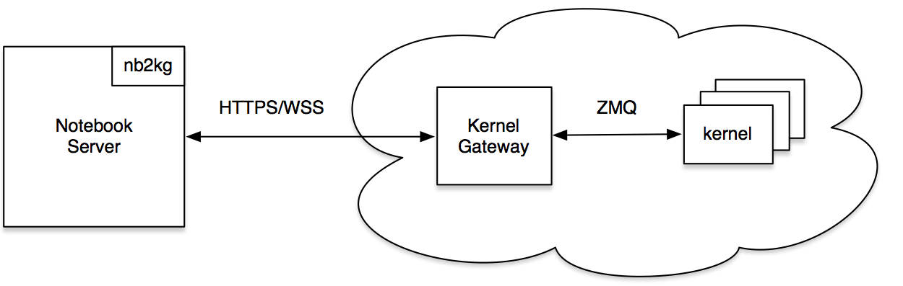

# Jupyter Remote Kernel development

## Getting started

A local stack runs two contianers. One is a regular Jupyter server with the ```nb2kg``` server extension installed, and the other runs ```jupyter-kernel-gateway```.



To start a fully working stack with a Jupyter notebook server and a kernel gateway we use docker-compose:

```
$ docker-compose build
$ docker-compose up -d
```

Once you've done this, get the login token from the logs:

```
$ docker-compose logs
```

and in your browser open, and input the login token

```
${your_notebook_server_host_ip}:9888
```

or to start Jupyterlab:

```
${your_notebook_server_host_ip}:9888/lab
```
